# 三次握手中的客户端connect异常查找

在 TCP 连接中，客户端在发起连接请求前会先确定一个客户端端口，然后用这个端口去和服务器端进行握手建立连接。客户端在发起 connect 系统调用的时候，主要工作就是端口选择。确切来说是端口选择的异常

#### connect 调用过程

```
SYSCALL_DEFINE3(connect
	|->inet_stream_ops
		|->inet_stream_connect
			|->tcp_v4_connect
				|->tcp_set_state(sk, TCP_SYN_SENT);设置状态为TCP_SYN_SENT
			 	|->inet_hash_connect
				|->tcp_connect
```

在客户端机上调用 connect 函数的时候，事实上会进入到内核的系统调用源码中进行执行。

```
//file: net/socket.c
SYSCALL_DEFINE3(connect, int, fd, struct sockaddr __user *, uservaddr,
  int, addrlen)
{
 struct socket *sock;

 //根据用户 fd 查找内核中的 socket 对象
 sock = sockfd_lookup_light(fd, &err, &fput_needed);

 //进行 connect
 err = sock->ops->connect(sock, (struct sockaddr *)&address, addrlen,
     sock->file->f_flags);
 ...
}
```

这段代码首先根据用户传入的 fd（文件描述符）来查询对应的 socket 内核对象。接下来 sock->ops->connect 其实调用的是 inet_stream_connect 函数。

```
//file: ipv4/af_inet.c
int inet_stream_connect(struct socket *sock, ...)
{ 
 ...
 __inet_stream_connect(sock, uaddr, addr_len, flags);
}

int __inet_stream_connect(struct socket *sock, ...)
{
 struct sock *sk = sock->sk;

 switch (sock->state) {
  case SS_UNCONNECTED:
   err = sk->sk_prot->connect(sk, uaddr, addr_len);
   sock->state = SS_CONNECTING;
   break;
 }
 ...
}
```

刚创建完毕的 socket 的状态就是 SS_UNCONNECTED，所以在 __inet_stream_connect 中的 switch 判断会进入到 case SS_UNCONNECTED 的处理逻辑中。

sk->sk_prot->connect 实际上对应的是 tcp_v4_connect 方法。

tcp_v4_connect 函数，它位于 net/ipv4/tcp_ipv4.c。

```
//file: net/ipv4/tcp_ipv4.c
int tcp_v4_connect(struct sock *sk, struct sockaddr *uaddr, int addr_len)
{
 //设置 socket 状态为 TCP_SYN_SENT
 tcp_set_state(sk, TCP_SYN_SENT);

 //动态选择一个端口
 err = inet_hash_connect(&tcp_death_row, sk);

 //函数用来根据 sk 中的信息，构建一个完成的 syn 报文，并将它发送出去。
 err = tcp_connect(sk);
}
```

在 tcp_v4_connect 中看到选择端口的函数，就是 inet_hash_connect。

#### 选择可用端口

```
//file:net/ipv4/inet_hashtables.c
int inet_hash_connect(struct inet_timewait_death_row *death_row,
        struct sock *sk)
{
 return __inet_hash_connect(death_row, sk, inet_sk_port_offset(sk),
   __inet_check_established, __inet_hash_nolisten);
}
```

在调用 __inet_hash_connect 时传入的两个重要参数。

- inet_sk_port_offset(sk)：这个函数是根据要连接的目的 IP 和端口等信息生成一个随机数。
- __inet_check_established：检查是否和现有 ESTABLISH 的连接是否冲突的时候用的函数

 __inet_hash_connect。

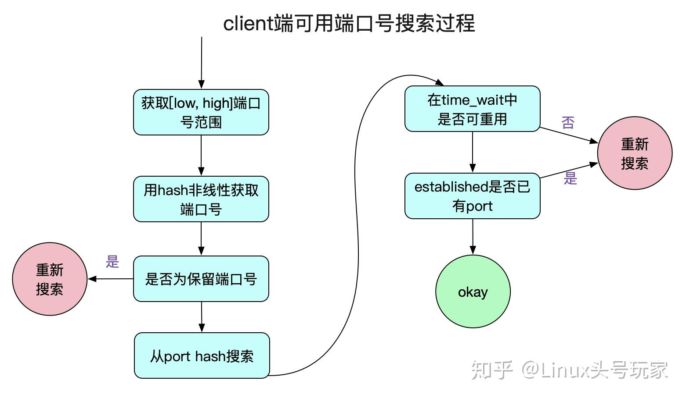

长连接（长期连接）和短连接（短期连接）是两种不同的网络连接方式。

1. 长连接：长连接是指在客户端和服务器之间建立一次连接后，可以持久保持该连接的状态进行双向通信。在长连接中，客户端和服务器可以随时进行数据的传输和接收，而无需频繁地建立和关闭连接。长连接通常用于实时通信、实时数据传输等场景，能够提供更快的响应和更高的性能效率。
2. 短连接：短连接是指在客户端和服务器之间进行一次请求和响应后，立即关闭连接。在短连接中，每次请求都需要重新建立连接，并在完成后立即关闭连接。短连接适用于简单的请求和响应场景，如传统的 HTTP 请求。短连接相对于长连接来说，每次连接都需要额外的开销，但在一些场景中，短连接可以更好地控制连接资源和避免连接的长时间空闲。

选择长连接还是短连接取决于具体应用的需求和场景。长连接适合需要保持实时通信或频繁数据交互的场景，而短连接适合于简单的单向请求和响应。

```
//file:net/ipv4/inet_hashtables.c
int __inet_hash_connect(...)
{
 //是否绑定过端口
 const unsigned short snum = inet_sk(sk)->inet_num;

 //获取本地端口配置
 inet_get_local_port_range(&low, &high);
  remaining = (high - low) + 1;

 if (!snum) {
  //遍历查找
  for (i = 1; i <= remaining; i++) {
   port = low + (i + offset) % remaining;
   ...
  }
 }
}
```

在这个函数中首先判断了 inet_sk(sk)->inet_num，如果我们调用过 bind绑定端口，那么这个函数会选择好端口并设置在 inet_num 上。没有调用过 bind， snum 为 0。

接着调用 inet_get_local_port_range，这个函数读取的是 net.ipv4.ip_local_port_range 这个内核参数。来读取可用的端口范围。

##### 获取端口号范围

首先，我们从内核中获取connect能够使用的端口号范围，在这里采用了Linux中的顺序锁(seqlock)。

```
void inet_get_local_port_range(int *low, int *high)
{
	unsigned int seq;

	do {
		// 顺序锁
		seq = read_seqbegin(&sysctl_local_ports.lock);

		*low = sysctl_local_ports.range[0];
		*high = sysctl_local_ports.range[1];
	} while (read_seqretry(&sysctl_local_ports.lock, seq));
}
```

顺序锁事实上就是结合内存屏障等机制的一种乐观锁，主要依靠一个序列计数器。在读取数据之前和之后，序列号都被读取,如果两者的序列号相同，说明在读操作的时候没有被写操作打断过。 这也保证了上面的读取变量都是一致的，也即low和high不会出现low是改前值而high是改后值得情况。

##### 通过hash决定端口号起始搜索范围

在Linux上进行connect,内核给其分配的端口号并不是线性增长的，但是也符合一定的规律。

```
int __inet_hash_connect(...)
{
		// 注意，这边是static变量
		static u32 hint;
		// 这边的port_offset是用对端ip:port hash的一个值
		// 也就是说对端ip:port固定,port_offset固定
		u32 offset = hint + port_offset;
		for (i = 1; i <= remaining; i++) {
			port = low + (i + offset) % remaining;
			/* port是否占用check */
			....
			goto ok;
		}
		.......
ok:
		hint += i;
		......
}
```

这里面有几个小细节，为了安全原因，Linux本身用对端ip:port做了一次hash作为搜索的初始offset，所以不同远端ip:port初始搜索范围可以基本是不同的！但同样的对端ip:port初始搜索范围是相同的！

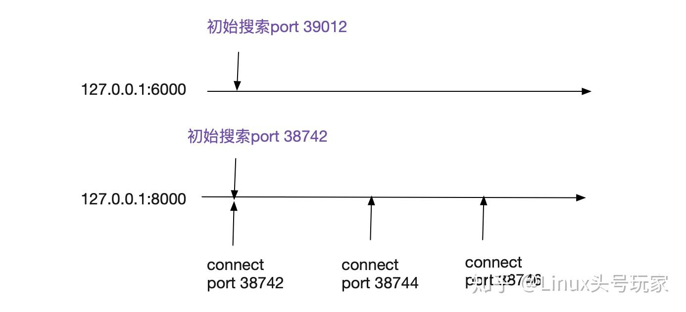

接下来进入到了 for 循环中。其中offset 就是通过 inet_sk_port_offset(sk) 计算出的随机数。那这段循环的作用就是从某个随机数开始，把整个可用端口范围来遍历一遍。直到找到可用的端口后停止。

```
//file:net/ipv4/inet_hashtables.c
int __inet_hash_connect(...)
{
 for (i = 1; i <= remaining; i++) {
  port = low + (i + offset) % remaining;

  //查看是否是保留端口，是则跳过
  if (inet_is_reserved_local_port(port))
   continue;

  // 查找和遍历已经使用的端口的哈希链表
  head = &hinfo->bhash[inet_bhashfn(net, port,
    hinfo->bhash_size)];
  inet_bind_bucket_for_each(tb, &head->chain) {

   //如果端口已经被使用
   if (net_eq(ib_net(tb), net) &&
       tb->port == port) {

                //通过 check_established 继续检查是否可用
    if (!check_established(death_row, sk,
       port, &tw))
     goto ok;
   }
  }

  //未使用的话，直接 ok
  goto ok;
 }

 return -EADDRNOTAVAIL;
ok: 
 ...  
}
```

首先判断的是 inet_is_reserved_local_port，这个很简单就是判断要选择的端口是否在 net.ipv4.ip_local_reserved_ports 中，在的话就不能用。

整个系统中会维护一个所有使用过的端口的哈希表，它就是 hinfo->bhash。接下来的代码就会在这里进行查找。**如果在哈希表中没有找到，那么说明这个端口是可用的。至此端口就算是找到了。**

遍历完所有端口都没找到合适的，就返回 -EADDRNOTAVAIL。

#### 端口被使用过怎么办，已经建立连接的端口？

这个问题在 __inet_hash_connect函数中进行处理，

```
//file:net/ipv4/inet_hashtables.c
int __inet_hash_connect(...)
{
 for (i = 1; i <= remaining; i++) {
  port = low + (i + offset) % remaining;

  ...
  //如果端口已经被使用
  if (net_eq(ib_net(tb), net) &&
       tb->port == port) {
   //通过 check_established 继续检查是否可用
   if (!check_established(death_row, sk, port, &tw))
    goto ok;
  }
 }
}
```

port 已经在 bhash 中如果已经存在，就表示有其它的连接使用过该端口了。**注意，如果 check_established 返回 0，该端口仍然可以接着使用！**。

check_established 作用就是检测现有的 TCP 连接中是否四元组和要建立的连接四元素完全一致。如果不完全一致，那么该端口仍然可用！！！

四元组

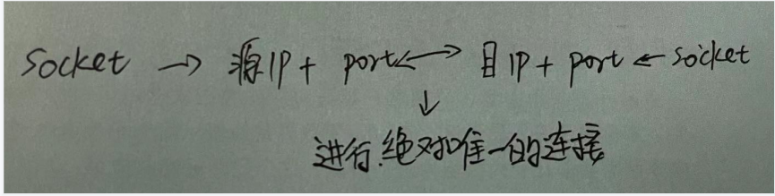

如果两对儿四元组中只要任意一个元素不同，都算是两条不同的连接。

例如：

```
连接1：192.168.1.101 5000 192.168.1.100 8090
连接2：192.168.1.101 5000 192.168.1.100 8091
```

这个 check_established ，实际上使用的是 __inet_check_established。

```
//file: net/ipv4/inet_hashtables.c
static int __inet_check_established(struct inet_timewait_death_row *death_row,
        struct sock *sk, __u16 lport,
        struct inet_timewait_sock **twp)
{
 //找到hash队列
 struct inet_ehash_bucket *head = inet_ehash_bucket(hinfo, hash);

 //遍历看看有没有四元组一样的，一样的话就报错
 sk_nulls_for_each(sk2, node, &head->chain) {
  if (sk2->sk_hash != hash)
   continue;
  if (likely(INET_MATCH(sk2, net, acookie,
          saddr, daddr, ports, dif)))
   goto not_unique;
 }

unique:
 //要用了，记录，返回 0 （成功）
 return 0;
not_unique:
 return -EADDRNOTAVAIL; 
}
```

该函数首先找到 inet_ehash_bucket，这个和 bhash 类似，只不过是所有 ESTABLISH 状态的 socket 组成的哈希表。然后遍历这个哈希表，使用 INET_MATCH 来判断是否可用。

这里 INET_MATCH 源码如下：

```
// include/net/inet_hashtables.h
#define INET_MATCH(__sk, __net, __cookie, __saddr, __daddr, __ports, __dif) \
 ((inet_sk(__sk)->inet_portpair == (__ports)) &&  \
  (inet_sk(__sk)->inet_daddr == (__saddr)) &&  \
  (inet_sk(__sk)->inet_rcv_saddr == (__daddr)) &&  \
  (!(__sk)->sk_bound_dev_if ||    \
    ((__sk)->sk_bound_dev_if == (__dif)))  &&  \
  net_eq(sock_net(__sk), (__net)))
```

在 INET_MATCH 中将 _ _saddr、_ _daddr、__ports 都进行了比较。

如果 MATCH，就是说就四元组完全一致的连接，所以这个端口不可用。也返回 -EADDRNOTAVAIL。

如果不 MATCH，哪怕四元组中有一个元素不一样，例如服务器的端口号不一样，那么就 return 0，表示该端口仍然可用于建立新连接。

再回到 tcp_v4_connect，这时我们的 inet_hash_connect 已经返回了一个可用端口了。接下来就进入到 tcp_connect，来发送 syn 包。如下源码所示。

```
//file: net/ipv4/tcp_ipv4.c
int tcp_v4_connect(struct sock *sk, struct sockaddr *uaddr, int addr_len)
{
 ......

 //动态选择一个端口
 err = inet_hash_connect(&tcp_death_row, sk);

 //函数用来根据 sk 中的信息，构建一个完成的 syn 报文，并将它发送出去。
 err = tcp_connect(sk);
}
```


**当端口不充足的时候**，会导致 connect 系统调用的时候过多地执行自旋锁等待与 Hash 查找，会引起 CPU 开销上涨。严重情况下会耗光 CPU，影响用户业务逻辑的执行。改善方法：

- 通过调整 ip_local_port_range 来尽量加大端口范围
- 尽量复用连接，使用长连接来削减频繁的握手处理
- 改换查找算法

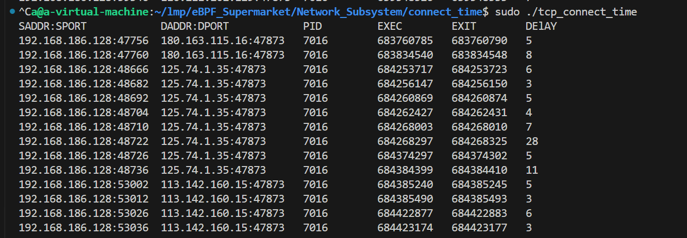

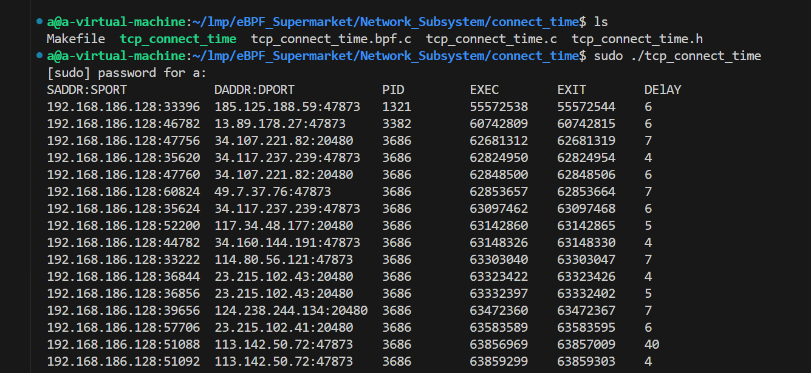


本周工作：

1.完成了三次握手中的丢包异常

2.论文：Design and implementation of an intrusion detection system by using Extended BPF in the Linux kernel

入侵检测系统的设计与实现Linux 内核中的扩展 BPF

3.学习了《深入理解Linux网络》第二章内核如何接收网络包


# 三次握手中的丢包异常

##### 客户端第一个【SYN】包丢了

1、如果在TCP连接中，客户端的第一个【SYN】包丢了，而此时跟服务器端并无联系，所以处理办法在客户端。
2、在TCP协议中，任何一端的【请求——应答】过程中，在一定时间范围内没有接收到对方的回应的【ACK】包，就会认为是丢包，此时触发超时重传机制。
3、此时会重传【SYN】包，会重传3次，时间间隔分别是： 5.8s、24s、48s，三次时间大约是 76s 左右，而大多数伯克利系统将建立一个新连接的最长时间，限制为 75s。

##### 服务器端收到【SYN】回复，但是回复的【SYN，ACK】包丢了

1、对于客户端来说，在规定时间内没有接收到来自服务器端的回复，会认为是自己丢包了，会进行重传【SYN】包。
2、对于服务器端来说，发出的【SYN，SCK】迟迟没有客户端的【ACK】回复，会触发重传，此时服务端处于 SYN_RCVD 状态，会依次等待 3s、6s、12s 后，重新发送【SYN，ACK】包；而【SYN，ACK】的重传次数，不同操作系统有不同的配置，例如在 Linux 下可以通过 tcp_synack_retries 进行配置，默认值为 5。如果这个重试次数内，仍未收到【ACK】应答包，那么服务端会自动关闭这个连接。
3、同时由于客户端在没有收到【SYN，ACK】时，也会进行重传，当客户端重传的【SYN】收到后，会立即重新发送【SYN，ACK】包。

##### 客户端收到【SYN，ACK】包，在回复时丢失【ACK】包

1、对于客户端，在发送【ACK】包后进入 ESTABLISHED 状态。多数情况下，客户端进入ESTABLISHED 状态后，认为连接已建立，会立即发送数据。
2、对于服务端，因为没有收到【ACK】会走**重传机制**，但是服务端因为没有收到最后一个【ACK】包，依然处于 SYN-RCVD 状态。
3、当服务端处于 SYN-RCVD 状态下时，接收到客户端真实发送来的数据包时，会认为连接已建立，并进入ESTABLISHED状态。
原因：
当客户端在 ESTABLISHED 状态下，开始发送数据包时，会携带上一个【ACK】的确认序号，所以哪怕客户端响应的【ACK】包丢了，服务端在收到这个数据包时，能够通过包内 ACK 的确认序号，正常进入 ESTABLISHED 状态。

## 第一次握手丢包

服务器在响应来自客户端的第一次握手请求的时候，会判断一下**半连接队列和全连接队列**是否溢出。如果发生溢出，可能会直接将握手包丢弃，而不会反馈给客户端。

#### 半连接队列满

```
//file: net/ipv4/tcp_ipv4.c
int tcp_v4_conn_request(struct sock *sk, struct sk_buff *skb)
{
 //看看半连接队列是否满了
 if (inet_csk_reqsk_queue_is_full(sk) && !isn) {
  want_cookie = tcp_syn_flood_action(sk, skb, "TCP");
  if (!want_cookie)
   goto drop;
 }

 //看看全连接队列是否满了
 ...
drop:
 NET_INC_STATS_BH(sock_net(sk), LINUX_MIB_LISTENDROPS);
 return 0; 
}
```

inet_csk_reqsk_queue_is_full 如果返回 true 就表示半连接队列满了，另外 tcp_syn_flood_action 判断是否打开了内核参数 tcp_syncookies，如果未打开则返回 false。

```
//file: net/ipv4/tcp_ipv4.c
bool tcp_syn_flood_action(...)
{
 bool want_cookie = false;

 if (sysctl_tcp_syncookies) {
  want_cookie = true;
 } 
 return want_cookie;
}
```

**如果半连接队列满了，而且 ipv4.tcp_syncookies 参数设置为 0，那么来自客户端的握手包将 goto drop，意思就是直接丢弃！**

### 全连接队列满

当半连接队列判断通过以后，紧接着还有全连接队列满的相关判断。如果这个条件成立，服务器对握手包的处理还是会 goto drop，丢弃了之。

```
//file: net/ipv4/tcp_ipv4.c
int tcp_v4_conn_request(struct sock *sk, struct sk_buff *skb)
{
 //看看半连接队列是否满了
 ...

 //看看全连接队列是否满了
 if (sk_acceptq_is_full(sk) && inet_csk_reqsk_queue_young(sk) > 1) {
  NET_INC_STATS_BH(sock_net(sk), LINUX_MIB_LISTENOVERFLOWS);
  goto drop;
 }
 ...
drop:
 NET_INC_STATS_BH(sock_net(sk), LINUX_MIB_LISTENDROPS);
 return 0; 
}
```

sk_acceptq_is_full 来判断全连接队列是否满了，inet_csk_reqsk_queue_young 判断的是有没有 young_ack（未处理完的半连接请求）。

这段代码可以看到，**假如全连接队列满的情况下，且同时有 young_ack ，那么内核同样直接丢掉该 SYN 握手包**。

##### TCP 第一次握手（收到 SYN 包）时会被丢弃的三种条件：

1. 如果半连接队列满了，并且没有开启 tcp_syncookies，则会丢弃；
2. 若全连接队列满了，且没有重传 SYN+ACK 包的连接请求多于 1 个，则会丢弃；
3. **如果没有开启 tcp_syncookies，并且 max_syn_backlog 减去 当前半连接队列长度小于 (max_syn_backlog >> 2)，则会丢弃；**

### 客户端发起重试

如果服务器侧发生了全/半连接队列溢出而导致的丢包。那么从转换到客户端视角来看就是 SYN 包没有任何响应。

客户端在发出握手包的时候，开启了一个重传定时器。如果收不到预期的 syn+ack 的话，超时重传的逻辑就会开始执行。不过重传计时器的时间单位都是以秒来计算的，这意味着，如果有握手重传发生，即使第一次重传就能成功，那接口最快响应也是 1 s 以后的事情了。这对接口耗时影响非常的大。

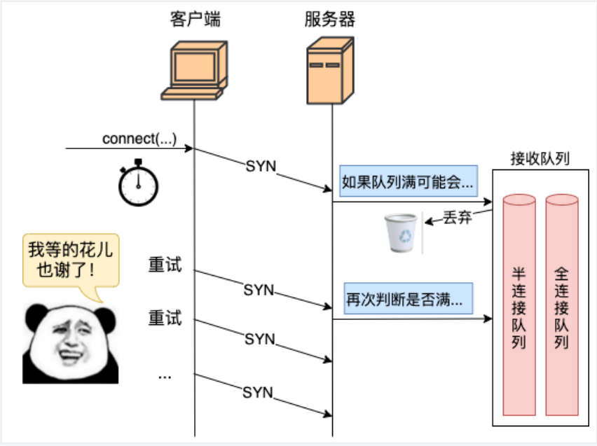

服务器在 connect 发出 syn 后就开启了重传定时器。

```
//file:net/ipv4/tcp_output.c
int tcp_connect(struct sock *sk)
{
 ...
 //实际发出 syn
 err = tp->fastopen_req ? tcp_send_syn_data(sk, buff) :
       tcp_transmit_skb(sk, buff, 1, sk->sk_allocation);

 //启动重传定时器
 inet_csk_reset_xmit_timer(sk, ICSK_TIME_RETRANS,
      inet_csk(sk)->icsk_rto, TCP_RTO_MAX);
}
```

在定时器设置中传入的 inet_csk(sk)->icsk_rto 是超时时间，该值初始的时候被设置为了 1 秒。

```
//file:ipv4/tcp_output.c
void tcp_connect_init(struct sock *sk)
{
 //初始化为 TCP_TIMEOUT_INIT 
 inet_csk(sk)->icsk_rto = TCP_TIMEOUT_INIT;
 ...
}

//file: include/net/tcp.h
#define TCP_TIMEOUT_INIT ((unsigned)(1*HZ)) 
```

如果能正常接收到服务器响应的 synack，那么客户端的这个定时器会清除。这段逻辑在 tcp_rearm_rto 里。（tcp_rcv_state_process -> tcp_rcv_synsent_state_process -> tcp_ack -> tcp_clean_rtx_queue -> tcp_rearm_rto）

```
//file:net/ipv4/tcp_input.c
void tcp_rearm_rto(struct sock *sk)
{
 inet_csk_clear_xmit_timer(sk, ICSK_TIME_RETRANS);
}
```

如果服务器端发生了丢包，那么定时器到时后会进行回调函数 tcp_write_timer 中进行重传。

```
//file: net/ipv4/tcp_timer.c
static void tcp_write_timer(unsigned long data)
{
 tcp_write_timer_handler(sk);
 ...
}

void tcp_write_timer_handler(struct sock *sk)
{
 //取出定时器类型。
 event = icsk->icsk_pending;

 switch (event) {
 case ICSK_TIME_RETRANS:
  icsk->icsk_pending = 0;
  //重传
  tcp_retransmit_timer(sk);
  break;
 ......
 }
}
```

tcp_retransmit_timer 是重传的主要函数。在这里完成重传，以及下一次定时器到期时间的设置。

```
//file: net/ipv4/tcp_timer.c
void tcp_retransmit_timer(struct sock *sk)
{
 ...

 //超过了重传次数则退出
 if (tcp_write_timeout(sk))
  goto out;

 //重传
 if (tcp_retransmit_skb(sk, tcp_write_queue_head(sk)) > 0) {
  //重传失败
  ......
 }

//退出前重新设置下一次超时时间
out_reset_timer:
 //计算超时时间
 if (sk->sk_state == TCP_ESTABLISHED ){
  ......
 } else {
  icsk->icsk_rto = min(icsk->icsk_rto << 1, TCP_RTO_MAX);
 }

 //设置
 inet_csk_reset_xmit_timer(sk, ICSK_TIME_RETRANS, icsk->icsk_rto, TCP_RTO_MAX); 
}
```

tcp_write_timeout 是判断是否重试过多，如果是则退出重试逻辑。

### **第三次握手丢包**

客户端在收到服务器的 synack 响应的时候，就认为连接建立成功了，然后会将自己的连接状态设置为 ESTABLISHED，发出第三次握手请求。但服务器在第三次握手的时候，还有可能会有意外发生。

```
//file: net/ipv4/tcp_ipv4.c
struct sock *tcp_v4_syn_recv_sock(struct sock *sk, ...)
{    
    //判断接收队列是不是满了
    if (sk_acceptq_is_full(sk))
        goto exit_overflow;
    ...
exit_overflow:
 NET_INC_STATS_BH(sock_net(sk), LINUX_MIB_LISTENOVERFLOWS);
 ...
}
```

从上述代码可以看出，**第三次握手时，如果服务器全连接队列满了，来自客户端的 ack 握手包又被直接丢弃了**。

三次握手完的请求是要放在全连接队列里的。但是假如全连接队列满了，仍然三次握手也不会成功。

**第三次握手失败并不是客户端重试，而是由客户端来重发 synack。**


#### 三次握手中的端口的状态变化

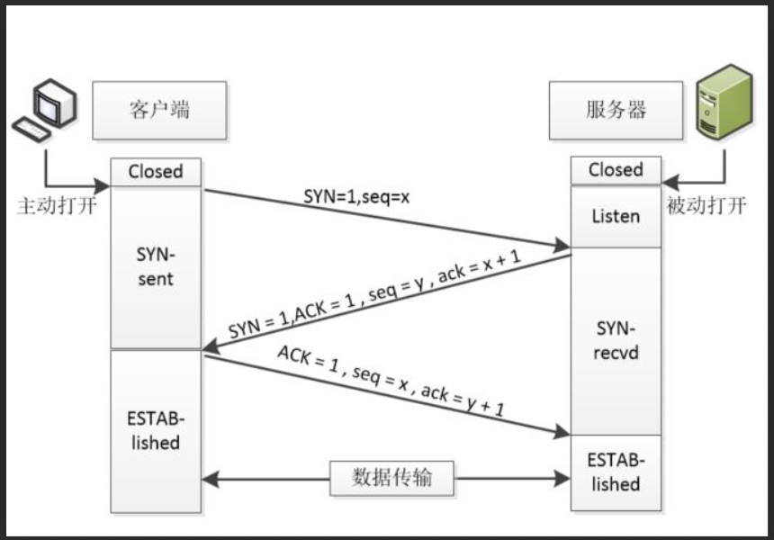

正常的 TCP 三次握手过程：

1、Client 端向 Server 端发送 SYN 发起握手，Client 端进入 SYN_SENT 状态

2、Server 端收到 Client 端的 SYN 请求后，Server 端进入 SYN_RECV 状态，此时内核会**将连接存储到半连接队列(SYN Queue)**，并向 Client 端回复 SYN+ACK

3、Client 端收到 Server 端的 SYN+ACK 后，Client 端回复 ACK 并进入 ESTABLISHED 状态

4、Server 端收到 Client 端的 ACK 后，内核**将连接从半连接队列(SYN Queue)中取出，添加到全连接队列(Accept Queue)**，Server 端进入 ESTABLISHED 状态

5、Server 端应用进程**调用 accept 函数时，将连接从全连接队列(Accept Queue)中取出**


**什么是 TCP 半连接队列和全连接队列？**

在 TCP 三次握手的时候，Linux 内核会维护两个队列，分别是：

- 半连接队列，也称 SYN 队列；
- 全连接队列，也称 accepet 队列；

服务端收到客户端发起的 SYN 请求后，**内核会把该连接存储到半连接队列**，并向客户端响应 SYN+ACK，接着客户端会返回 ACK，服务端收到第三次握手的 ACK 后，**内核会把连接从半连接队列移除，然后创建新的完全的连接，并将其添加到 accept 队列，等待进程调用 accept 函数时把连接取出来。**

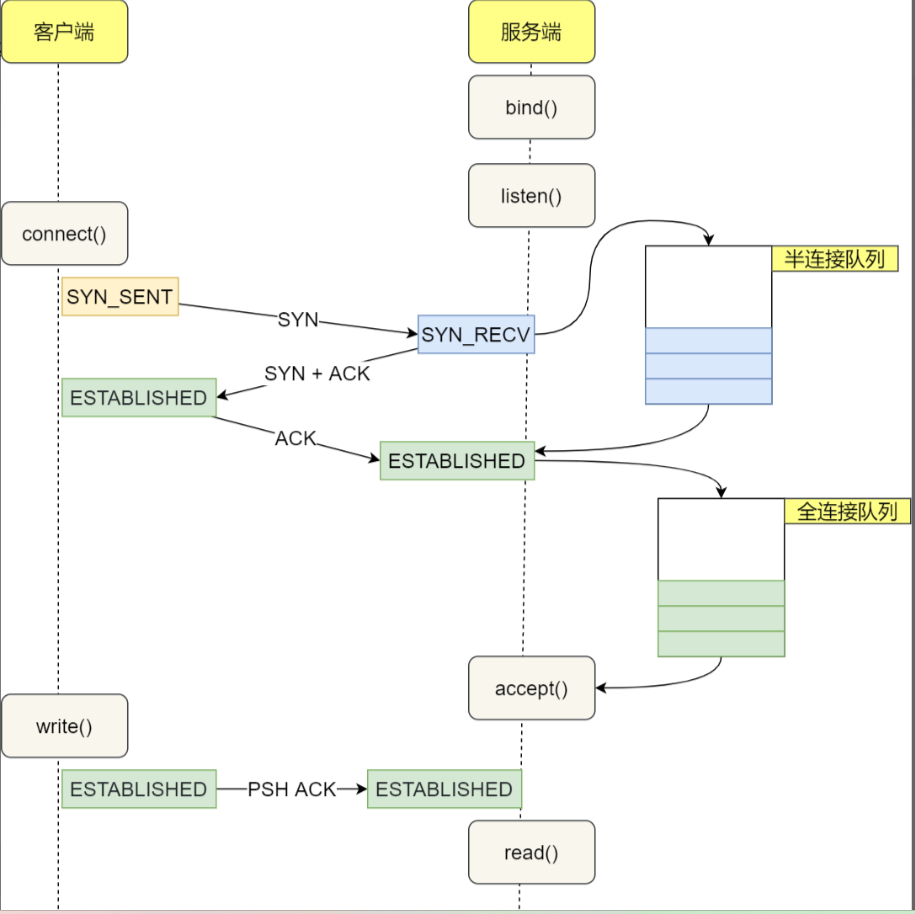

不管是半连接队列还是全连接队列，都有最大长度限制，超过限制时，内核会直接丢弃，或返回 RST 包。

**全连接队列最大长度控制**

TCP 全连接队列的最大长度由 min(somaxconn, backlog) 控制，其中：

- somaxconn 是 Linux 内核参数，由 /proc/sys/net/core/somaxconn 指定
- backlog 是 TCP 协议中 listen 函数的参数之一，即 int listen(int sockfd, int backlog) 函数中的 backlog 大小。

```
/net/socket.c
int __sys_listen(int fd, int backlog)
{
....

	sock = sockfd_lookup_light(fd, &err, &fput_needed);
	if (sock) {
		// /proc/sys/net/core/somaxconn
		somaxconn = READ_ONCE(sock_net(sock->sk)->core.sysctl_somaxconn);
		if ((unsigned int)backlog > somaxconn)
			//// TCP 全连接队列最大长度 min(somaxconn, backlog)
			backlog = somaxconn;

		err = security_socket_listen(sock, backlog);
		if (!err)
			err = sock->ops->listen(sock, backlog);

		fput_light(sock->file, fput_needed);
	}
	return err;
}
```

##### **TCP 全连接队列溢出**

可以使用 `ss` 命令，来查看 TCP 全连接队列的情况：

但需要注意的是 `ss` 命令获取的 `Recv-Q/Send-Q` 在「LISTEN 状态」和「非 LISTEN 状态」所表达的含义是不同的。从下面的内核代码可以看出区别：

```
/net/ipv4/tcp_diag.c
static void tcp_diag_get_info(struct sock *sk, struct inet_diag_msg *r,
			      void *_info)
{
	struct tcp_info *info = _info;
	
	//如果TCP连接的状态是LISTEN时
	if (inet_sk_state_load(sk) == TCP_LISTEN) {
		//当前全连接队列的大小
		r->idiag_rqueue = READ_ONCE(sk->sk_ack_backlog);
		//当前全链接最大队列的长度
		r->idiag_wqueue = READ_ONCE(sk->sk_max_ack_backlog);
		//如果TCP连接的状态不是LISTEN时
	} else if (sk->sk_type == SOCK_STREAM) {
		const struct tcp_sock *tp = tcp_sk(sk);
		//已收到但未被应用程序进程读取的字节数
		r->idiag_rqueue = max_t(int, READ_ONCE(tp->rcv_nxt) -
					     READ_ONCE(tp->copied_seq), 0);
		//已发送但未收到确认的字节数
		r->idiag_wqueue = READ_ONCE(tp->write_seq) - tp->snd_una;
	}
	if (info)
		tcp_get_info(sk, info);
}
```

处于**LISTENING状态**，端口是开放的，等待被连接。

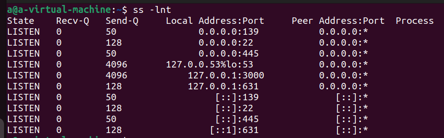

```
-l 显示正在监听的（listening）的socket
-n 不显示服务名称
-t 只显示tcp socket
```

- Recv-Q：当前全连接队列的大小，也就是当前已完成三次握手并等待服务端 `accept()` 的 TCP 连接；
- Send-Q：当前全连接最大队列长度，上面的输出结果说明监听 22 端口的 TCP 服务，最大全连接长度为 128；

在「非 LISTEN 状态」时，

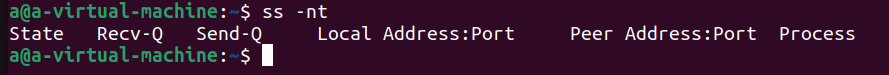

- Recv-Q：已收到但未被应用进程读取的字节数；
- Send-Q：已发送但未收到确认的字节数；

**当服务端并发处理大量请求时，如果 TCP 全连接队列过小，就容易溢出。发生 TCP 全连接队溢出的时候，后续的请求就会被丢弃，这样就会出现服务端请求数量上不去的现象。**

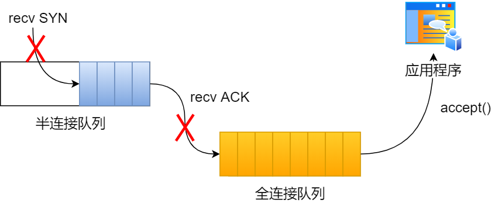

#### 如何增大 TCP 全连接队列呢？

**TCP 全连接队列足最大值取决于 somaxconn 和 backlog 之间的最小值，也就是 min(somaxconn, backlog)**。从下面的 Linux 内核代码可以得知：

```
// Listen 函数调用的内核源码
SYSCALL_DEFINE2(listen, int， fd, int, backlog)
{
	...
	// /proc/sys/net/core/somaxconn
	somaxconn = sock_net(sock->sk)->core.syscti_somaxconn;
	
	// TCP 全连接队列最大值 = min(somaxconn， backlog)
	if ((unsigned)backlog > somaxconn)
		backlog = somaxconn;
		
	...
}
```

**如果持续不断地有连接因为 TCP 全连接队列溢出被丢弃，就应该调大 backlog 以及 somaxconn 参数。**


##### TCP半队列溢出

半连接队列的大小并不单单只跟 `tcp_max_syn_backlog` 有关系。

三个条件因队列长度的关系而被丢弃的：

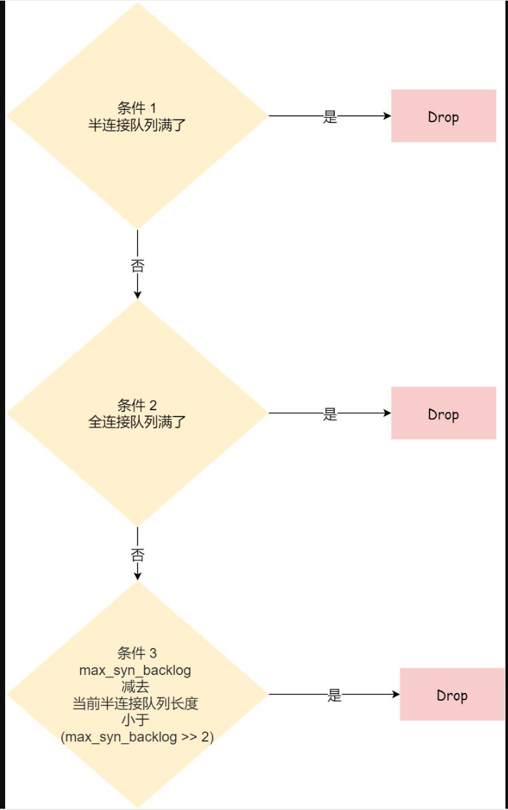

1. **如果半连接队列满了，并且没有开启 tcp_syncookies，则会丢弃；**
2. **若全连接队列满了，且没有重传 SYN+ACK 包的连接请求多于 1 个，则会丢弃；**
3. **如果没有开启 tcp_syncookies，并且 max_syn_backlog 减去 当前半连接队列长度小于 (max_syn_backlog >> 2)，则会丢弃；**

检测半连接队列是否满的函数 inet_csk_reqsk_queue_is_full 和 检测全连接队列是否满的函数 sk_acceptq_is_full 

```
/include/net/inet_connection_sock.h
static inline int inet_csk_reqsk_queue_is_full(const struct sock *sk)
{
	//检测半连接队列是否已满
	return inet_csk_reqsk_queue_len(sk) >= sk->sk_max_ack_backlog;
}
```

```
/include/net/sock.h
static inline bool sk_acceptq_is_full(const struct sock *sk)
{	
	//检测全连接队列是否已满	
	return READ_ONCE(sk->sk_ack_backlog) > READ_ONCE(sk->sk_max_ack_backlog);
}
```


查看本机的重发包次数

```
// 第一次握手重传次数限制
cat /proc/sys/net/ipv4/tcp_syn_retries

// 第二次握手重传次数限制
cat /proc/sys/net/ipv4/tcp_synack_retries

// 数据包最大重传次数限制
cat /proc/sys/net/ipv4/tcp_retries2
```

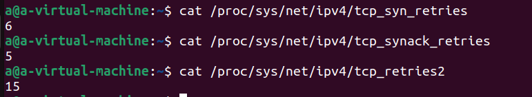

观察本机的重发包过程

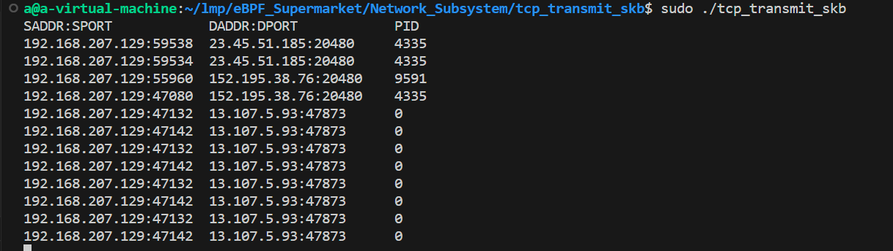


