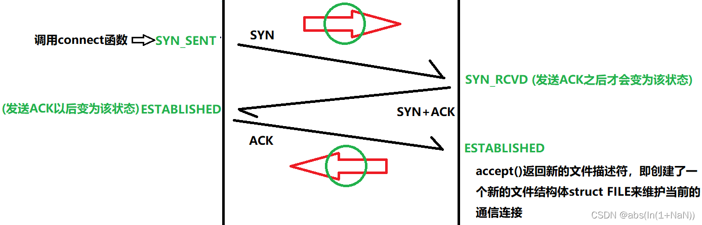

# 三次握手过程监控

## TCP三次握手


有一个问题：如果双方建立连接成功，而一方网络中断，那对方是感知不到的。因为链接的双方之间是没有实际的物理连接的，双方只是有包的时候发包每包的时候不使用的。有内核进行监督，在发送包之前内核进行探测（keepalive），并且 keepalive 只检测链接的健康。


**三次握手**

三次握手其实就是双方建立资源链接的过程，三次握手四次挥手其实都是在传输控制层完成的。数据包从应用层到发出，向下一次加上了TCP报头，IP报头，以太网报头。 

为什么是三次握手，不是一次或者两次？

如果只有一次握手，双方无法确认对方的接收能力是否正常；如果只有两次握手，无法防止已失效的连接请求报文段被对方接收而产生错误。一次握手时，客户端一次发送多条连接请求，服务端一次可能接收到几百万条连接请求，服务端对每一条请求都建立服务时，资源很快就会消耗完。
**第一次握手**

客户发送第一个报文段(SYN报文段)，在这个报文段中只有SYN标志置为1。这个报文段的作用是同步序号。 请注意，这个报文段中不包括确认号，也没有定义窗口大小。只有当一个报文段中包含了确认时，定义窗口大小才有意义。这个报文段还可以包含一些选项。请注意，SYN报文段是一个控制报文段，它不携带任何数据。但是，它消耗了一个序号。当数据传送开始时，序号就应当加1。我们可以说，SYN报文段不包含真正的数据，但是我们可以想象它包含了一个虚字节。

 **SYN报文段不携带任何数据，但是它要消耗一个序号。**


**第二次握手**

服务器发送第二个报文段，即SYN + ACK报文段，其中的两个标志(SYN和ACK)置为1。这个报文段有两个目的。首先，它是另一个方向上通信的SYN报文段。服务器使用这个报文段来同步它的初始序号，以便从服务器向客户发送字节。其次，服务器还通过ACK标志来确认已收到来自客户端的SYN报文段，同时给出期望从客户端收到的下一个序号。因为这个报文段包含了确认，所以它还需要定义接收窗口大小，即rwnd (由客户端使用)。

**SYN+ACK报文段不携带数据，但要消耗一个序号。**）


**第三次握手**

客户发送第三个报文段。这仅仅是一一个ACK报文段。它使用ACK标志和确认号:字段来确认收到了第二个报文段。请注意，这个报文段的序号和SYN报文段使用的序号一样，也就是说，这个ACK报文段不消耗任何序号。客户还必须定义服务器的窗口大小。在某些实现中，连接阶段的第三个报文段可以携带客户的第一一个数据块。在这种情况下，第三个报文段必须有一个新的序号来表示数据中的第一个字节的编号。通常，第三个报文段不携带数据，因而不消耗序号。

**ACK报文段如果不携带数据就不消耗序号。**

服务端如果收到客户端的应答，就说明Client 也同意建立连接，至此 Server ==》Client方向上的连接也就建立好了。服务端也认为连接建立成功了；如果迟迟没有收到，服务端认为客户端不希望与自己建立 Server ==》客户端方向上的连接，此时会连接失败。
服务端状态：ESTABLISHED（建立连接）/ CLOSED（连接失败）



```
SYN：请求同步标志，为1的时候为有效 
ACK：应答标志，表示接受到所发的数据，1为有效 
```

**使用 wireshark 抓包工具对三次握手进行分析**

ip.dst 表示目标地址


图中可以看到wireshark截获到了三次握手的三个数据包。第四个包才是HTTP的， 这说明HTTP的确是使用TCP建立连接的。

第一次握手数据包

客户端发送一个TCP，标志位为SYN，序列号为0， 代表客户端请求建立连接。 如下图。


数据包的关键属性如下：

SYN ：标志位，表示请求建立连接

Seq = 0 ：初始建立连接值为0，数据包的相对序列号从0开始，表示当前还没有发送数据

Ack =0：初始建立连接值为0，已经收到包的数量，表示当前没有接收到数据

第二次握手的数据包

服务器发回确认包, 标志位为 SYN,ACK. 将确认序号(Acknowledgement Number)设置为客户的I S N加1，即0+1=1, 如下图


数据包的关键属性如下：

Seq = 0 ：初始建立值为0，表示当前还没有发送数据

Ack = 1：表示当前端成功接收的数据位数，虽然客户端没有发送任何有效数据，确认号还是被加1，因为包含SYN或FIN标志位。（并不会对有效数据的计数产生影响，因为含有SYN或FIN标志位的包并不携带有效数据）

第三次握手的数据包

客户端再次发送确认包(ACK) SYN标志位为0,ACK标志位为1.并且把服务器发来ACK的序号字段+1,放在确定字段中发送给对方.并且在数据段放写ISN的+1, 如下图:


ACK ：标志位，表示已经收到记录

Seq = 1 ：表示当前已经发送1个数据

Ack = 1 : 表示当前端成功接收的数据位数，虽然服务端没有发送任何有效数据，确认号还是被加1，因为包含SYN或FIN标志位（并不会对有效数据的计数产生影响，因为含有SYN或FIN标志位的包并不携带有效数据)。

就这样通过了TCP三次握手，建立了连接。开始进行数据交互。

使用tcpdump进行抓包

```
tcpdump -nn -i ens33 port 80
-n 在网络中表示不显示端口的字符形式
抓 ens33 port 80 上的端口号为80的包
```

```
curl 可以请求回数据
```

[S]表示SYN握手的包

[S.]表示SYN+ACK确认


第一个包是本机 52380 向 254.80 （百度）发送了一个握手的包，长度 length 为0;

第二个包是百度 254.80 向本地 254.80 回了一个确认 （SYN+ACK），长度 length 也为 0;

第三个包是本机 52380向 254.80 回了一个收到，长度也为0。

从这一个包往后的包的长度就不是0了，可以看到变成了 77 其中是对一些 HTTP 头或者协议的封装。

254.80 回了一个 ack 长度为0，就是可靠性。之后再进行一系列的发送和返回。

直到进行四次分手


**深入内核了解三次握手的过程**

```
a@a-virtual-machine:~/Desktop/LinuxKernel/linuxnet/lab5$ qemu-system-i386 -kernel ../../linux-5.0.1/arch/x86/boot/bzImage -initrd ../rootfs.img -append nokaslr -s -S
打开QEMU
重开一个终端
gdb
file ~/Desktop/LinuxKernel/linux-5.0.1/vmlinux #加载符号表
break ******  #在main.c中的start_kernel函数处添加断点
target remote:1234 #连接GDB server
continue #让MenuOS继续执行
在QEMU中输入hello
list #显示断点处的代码
```


**一、客户端 connect**


首先客户端通过调用 connect 来发起连接。在 connect 系统调用中会进入到内核源码的 tcp_v4_connect。

**Client**端函数调用顺序大致是 __sys_connect、__sys_connect_file、inet_stream_connect、tcp_v4_connect、tcp_connect、tcp_connect_queue_skb

```
//file: net/ipv4/tcp_ipv4.c
int tcp_v4_connect(struct sock *sk, struct sockaddr *uaddr, int addr_len)
{
 //设置 socket 状态为 TCP_SYN_SENT
 tcp_set_state(sk, TCP_SYN_SENT);

 //动态选择一个端口
 err = inet_hash_connect(&tcp_death_row, sk);

 //函数用来根据 sk 中的信息，构建一个完成的 syn 报文，并将它发送出去。
 err = tcp_connect(sk);
}
```

在这里将完成把 socket 状态设置为 TCP_SYN_SENT。 再通过 inet_hash_connect 来动态地选择一个可用的端口后，进入到 tcp_connect 中。

```
//file:net/ipv4/tcp_output.c
int tcp_connect(struct sock *sk)
{
 tcp_connect_init(sk);

 //申请 skb 并构造为一个 SYN 包
 ......

 //添加到发送队列 sk_write_queue 上
 tcp_connect_queue_skb(sk, buff);

 //实际发出 syn
 err = tp->fastopen_req ? tcp_send_syn_data(sk, buff) :
    tcp_transmit_skb(sk, buff, 1, sk->sk_allocation);

 //启动重传定时器
 inet_csk_reset_xmit_timer(sk, ICSK_TIME_RETRANS,
      inet_csk(sk)->icsk_rto, TCP_RTO_MAX);
}
```

在 tcp_connect 申请和构造 SYN 包，然后将其发出。同时还启动了一个重传定时器，该定时器的作用是等到一定时间后收不到服务器的反馈的时候来开启重传。

**二、服务器端响应SYN**


在服务器端，所有的 TCP 包（包括客户端发来的 SYN 握手请求）都经过网卡、软中断，进入到 tcp_v4_rcv。 在该函数中根据网络包（skb）TCP 头信息中的目的 IP 信息查到当前在 listen 的 socket。然后继续进入 tcp_v4_do_rcv 处理握手过程。

**Server**端函数调用顺序大致是tcp_v4_rcv、tcp_v4_do_rcv、tcp_rcv_state_process、tcp_v4_conn_request、tcp_conn_request、tcp_v4_send_synack

```
//file: net/ipv4/tcp_ipv4.c
int tcp_v4_do_rcv(struct sock *sk, struct sk_buff *skb)
{
 ...
 //服务器收到第一步握手 SYN 或者第三步 ACK 都会走到这里
 if (sk->sk_state == TCP_LISTEN) {
  struct sock *nsk = tcp_v4_hnd_req(sk, skb);
 }

 if (tcp_rcv_state_process(sk, skb, tcp_hdr(skb), skb->len)) {
  rsk = sk;
  goto reset;
 }
}
```

在 tcp_v4_do_rcv 中判断当前 socket 是 listen 状态后，首先会到 tcp_v4_hnd_req 去查看半连接队列。服务器第一次响应 SYN 的时候，半连接队列里必然是空空如也，所以相当于什么也没干就返回了。

```
//file:net/ipv4/tcp_ipv4.c
static struct sock *tcp_v4_hnd_req(struct sock *sk, struct sk_buff *skb)
{
 // 查找 listen socket 的半连接队列
 struct request_sock *req = inet_csk_search_req(sk, &prev, th->source,
          iph->saddr, iph->daddr);
 ...
 return sk;
}
```

在 tcp_rcv_state_process 里根据不同的 socket 状态进行不同的处理。

```
//file:net/ipv4/tcp_input.c
int tcp_rcv_state_process(struct sock *sk, struct sk_buff *skb,
     const struct tcphdr *th, unsigned int len)
{
 switch (sk->sk_state) {
  //第一次握手
  case TCP_LISTEN:
   if (th->syn) { //判断是 SYN 握手包
    ...
    if (icsk->icsk_af_ops->conn_request(sk, skb) < 0)
     return 1;
 ......
} 
```

其中 conn_request 是一个函数指针，指向 tcp_v4_conn_request。服务器响应 SYN 的主要处理逻辑都在这个 tcp_v4_conn_request 里。

```
//file: net/ipv4/tcp_ipv4.c
int tcp_v4_conn_request(struct sock *sk, struct sk_buff *skb)
{
 //看看半连接队列是否满了
 if (inet_csk_reqsk_queue_is_full(sk) && !isn) {
  want_cookie = tcp_syn_flood_action(sk, skb, "TCP");
  if (!want_cookie)
   goto drop;
 }

 //在全连接队列满的情况下，如果有 young_ack，那么直接丢
 if (sk_acceptq_is_full(sk) && inet_csk_reqsk_queue_young(sk) > 1) {
  NET_INC_STATS_BH(sock_net(sk), LINUX_MIB_LISTENOVERFLOWS);
  goto drop;
 }
 ...
 //分配 request_sock 内核对象
 req = inet_reqsk_alloc(&tcp_request_sock_ops);

 //构造 syn+ack 包
 skb_synack = tcp_make_synack(sk, dst, req,
  fastopen_cookie_present(&valid_foc) ? &valid_foc : NULL);

 if (likely(!do_fastopen)) {
  //发送 syn + ack 响应
  err = ip_build_and_send_pkt(skb_synack, sk, ireq->loc_addr,
    ireq->rmt_addr, ireq->opt);

  //添加到半连接队列，并开启计时器
  inet_csk_reqsk_queue_hash_add(sk, req, TCP_TIMEOUT_INIT);
 }else ...
}
```

在这里首先判断半连接队列是否满了，如果满了的话进入 tcp_syn_flood_action 去判断是否开启了 tcp_syncookies 内核参数。 如果队列满，且未开启 tcp_syncookies，那么该握手包将直接被丢弃！！

接着还要判断全连接队列是否满。因为全连接队列满也会导致握手异常的，那干脆就在第一次握手的时候也判断了。如果全连接队列满了，且有 young_ack 的话，那么同样也是直接丢弃。

接下来是构造 synack 包，然后通过 ip_build_and_send_pkt 把它发送出去。

最后把当前握手信息添加到半连接队列，并开启计时器。计时器的作用是如果某个时间之内还收不到客户端的第三次握手的话，服务器会重传 synack 包。

**三、客户端响响应SYN　ACK**


客户端收到服务器端发来的 synack 包的时候，也会进入到 tcp_rcv_state_process 函数中来。不过由于自身 socket 的状态是 TCP_SYN_SENT，所以会进入到另一个不同的分支中去。

**Client**端函数调用顺序大致是tcp_v4_rcv、tcp_v4_do_rcv、tcp_rcv_state_process、tcp_rcv_synsent_state_process、tcp_finish_connect、tcp_send_ack

```
//file:net/ipv4/tcp_input.c
//除了 ESTABLISHED 和 TIME_WAIT，其他状态下的 TCP 处理都走这里
int tcp_rcv_state_process(struct sock *sk, struct sk_buff *skb,
     const struct tcphdr *th, unsigned int len)
{
 switch (sk->sk_state) {
  //服务器收到第一个ACK包
  case TCP_LISTEN:
   ...
  //客户端第二次握手处理 
  case TCP_SYN_SENT:
   //处理 synack 包
   queued = tcp_rcv_synsent_state_process(sk, skb, th, len);
   ...
   return 0;
}
```

tcp_rcv_synsent_state_process 是客户端响应 synack 的主要逻辑。

```
//file:net/ipv4/tcp_input.c
static int tcp_rcv_synsent_state_process(struct sock *sk, struct sk_buff *skb,
      const struct tcphdr *th, unsigned int len)
{
 ...

 tcp_ack(sk, skb, FLAG_SLOWPATH);

 //连接建立完成 
 tcp_finish_connect(sk, skb);

 if (sk->sk_write_pending ||
   icsk->icsk_accept_queue.rskq_defer_accept ||
   icsk->icsk_ack.pingpong)
  //延迟确认...
 else {
  tcp_send_ack(sk);
 }
}
```

tcp_ack()->tcp_clean_rtx_queue()

```
//file: net/ipv4/tcp_input.c
static int tcp_clean_rtx_queue(struct sock *sk, int prior_fackets,
       u32 prior_snd_una)
{
 //删除发送队列
 ...

 //删除定时器
 tcp_rearm_rto(sk);
}

//file: net/ipv4/tcp_input.c
void tcp_finish_connect(struct sock *sk, struct sk_buff *skb)
{
 //修改 socket 状态
 tcp_set_state(sk, TCP_ESTABLISHED);

 //初始化拥塞控制
 tcp_init_congestion_control(sk);
 ...

 //保活计时器打开
 if (sock_flag(sk, SOCK_KEEPOPEN))
  inet_csk_reset_keepalive_timer(sk, keepalive_time_when(tp));
}
```

客户端修改自己的 socket 状态为 ESTABLISHED，接着打开 TCP 的保活计时器。

```
//file:net/ipv4/tcp_output.c
void tcp_send_ack(struct sock *sk)
{
 //申请和构造 ack 包
 buff = alloc_skb(MAX_TCP_HEADER, sk_gfp_atomic(sk, GFP_ATOMIC));
 ...

 //发送出去
 tcp_transmit_skb(sk, buff, 0, sk_gfp_atomic(sk, GFP_ATOMIC));
}
```

在 tcp_send_ack 中构造 ack 包，并把它发送了出去。

客户端响应来自服务器端的 synack 时清除了 connect 时设置的重传定时器，把当前 socket 状态设置为 ESTABLISHED，开启保活计时器后发出第三次握手的 ack 确认。

**四、服务端响应ACK**


服务器响应第三次握手的 ack 时同样会进入到 tcp_v4_do_rcv

**Server**端函数调用顺序大致是tcp_v4_rcv、tcp_check_req、tcp_v4_syn_recv_sock 、tcp_create_openreq_child、inet_csk_clone_lock、inet_ehash_nolisten、inet_csk_complete_hashdance、tcp_child_process、tcp_rcv_state_process

```
//file: net/ipv4/tcp_ipv4.c
int tcp_v4_do_rcv(struct sock *sk, struct sk_buff *skb)
{
 ...
 if (sk->sk_state == TCP_LISTEN) {
  struct sock *nsk = tcp_v4_hnd_req(sk, skb);

  if (nsk != sk) {
   if (tcp_child_process(sk, nsk, skb)) {
    ...
   }
   return 0;
  }
 }
 ...
}
```

不过由于这已经是第三次握手了，半连接队列里会存在上次第一次握手时留下的半连接信息。所以 tcp_v4_hnd_req 的执行逻辑会不太一样。

```
//file:net/ipv4/tcp_ipv4.c
static struct sock *tcp_v4_hnd_req(struct sock *sk, struct sk_buff *skb)
{
 ...
 struct request_sock *req = inet_csk_search_req(sk, &prev, th->source,
          iph->saddr, iph->daddr);
 if (req)
  return tcp_check_req(sk, skb, req, prev, false);
 ...
}
```

inet_csk_search_req 负责在半连接队列里进行查找，找到以后返回一个半连接 request_sock 对象。然后进入到 tcp_check_req 中。

```
//file：net/ipv4/tcp_minisocks.c
struct sock *tcp_check_req(struct sock *sk, struct sk_buff *skb,
      struct request_sock *req,
      struct request_sock **prev,
      bool fastopen)
{
 ...
 //创建子 socket
 child = inet_csk(sk)->icsk_af_ops->syn_recv_sock(sk, skb, req, NULL);
 ...

 //清理半连接队列
 inet_csk_reqsk_queue_unlink(sk, req, prev);
 inet_csk_reqsk_queue_removed(sk, req);

 //添加全连接队列
 inet_csk_reqsk_queue_add(sk, req, child);
 return child;
}
```

创建socket

icsk_af_ops->syn_recv_sock 对应的是 tcp_v4_syn_recv_sock 函数。

```
//file:net/ipv4/tcp_ipv4.c
const struct inet_connection_sock_af_ops ipv4_specific = {
 ......
 .conn_request      = tcp_v4_conn_request,
 .syn_recv_sock     = tcp_v4_syn_recv_sock,

//三次握手接近就算是完毕了，这里创建 sock 内核对象
struct sock *tcp_v4_syn_recv_sock(struct sock *sk, struct sk_buff *skb,
      struct request_sock *req,
      struct dst_entry *dst)
{    
 //判断接收队列是不是满了
 if (sk_acceptq_is_full(sk))
  goto exit_overflow;

 //创建 sock && 初始化
 newsk = tcp_create_openreq_child(sk, req, skb);
```

删除半连接队列

把连接请求块从半连接队列中删除。

```
//file: include/net/inet_connection_sock.h 
static inline void inet_csk_reqsk_queue_unlink(struct sock *sk, struct request_sock *req,
 struct request_sock **prev)
{
 reqsk_queue_unlink(&inet_csk(sk)->icsk_accept_queue, req, prev);
}
```

reqsk_queue_unlink 中把连接请求块从半连接队列中删除。

添加全连接队列

```
//file:net/ipv4/syncookies.c
static inline void inet_csk_reqsk_queue_add(struct sock *sk,
      struct request_sock *req,
      struct sock *child)
{
 reqsk_queue_add(&inet_csk(sk)->icsk_accept_queue, req, sk, child);
}
```

在 reqsk_queue_add 中将握手成功的 request_sock 对象插入到全连接队列链表的尾部。

```
//file: include/net/request_sock.h
static inline void reqsk_queue_add(...)
{
 req->sk = child;
 sk_acceptq_added(parent);

 if (queue->rskq_accept_head == NULL)
  queue->rskq_accept_head = req;
 else
  queue->rskq_accept_tail->dl_next = req;

 queue->rskq_accept_tail = req;
 req->dl_next = NULL;
}
```

设置连接为 ESTABLISHED

tcp_v4_do_rcv => tcp_child_process => tcp_rcv_state_process

```
//file:net/ipv4/tcp_input.c
int tcp_rcv_state_process(struct sock *sk, struct sk_buff *skb,
     const struct tcphdr *th, unsigned int len)
{
 ...
 switch (sk->sk_state) {

  //服务端第三次握手处理
  case TCP_SYN_RECV:

   //改变状态为连接
   tcp_set_state(sk, TCP_ESTABLISHED);
   ...
 }
}
```

将连接设置为 TCP_ESTABLISHED 状态。

服务器响应第三次握手 ack 所做的工作是把当前半连接对象删除，创建了新的 sock 后加入到全连接队列中，最后将新连接状态设置为 ESTABLISHED。

服务器 accept

```
//file: net/ipv4/inet_connection_sock.c
struct sock *inet_csk_accept(struct sock *sk, int flags, int *err)
{
 //从全连接队列中获取
 struct request_sock_queue *queue = &icsk->icsk_accept_queue;
 req = reqsk_queue_remove(queue);

 newsk = req->sk;
 return newsk;
}
```

reqsk_queue_remove 这个操作很简单，就是从全连接队列的链表里获取出第一个元素返回就行了。

```
//file:include/net/request_sock.h
static inline struct request_sock *reqsk_queue_remove(struct request_sock_queue *queue)
{
 struct request_sock *req = queue->rskq_accept_head;

 queue->rskq_accept_head = req->dl_next;
 if (queue->rskq_accept_head == NULL)
  queue->rskq_accept_tail = NULL;

 return req;
}
```

使用一张图总结起来：


