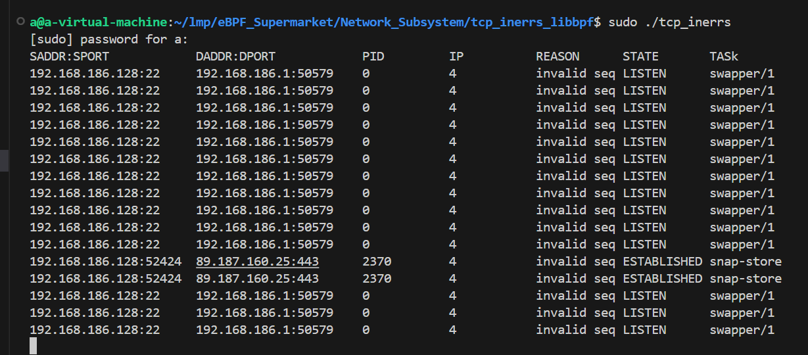

# 网络子系统框架

1.学习网络子系统建立链接后的传输层处理

2.编写代码，输出传输层中有问题的数据包信息

3.完善网络协议栈


## Linux TCP数据包接收入口处理 tcp_v4_rcv

tcp对输入数据包的整体处理流程可以用下图表示：

**在17年后的Linux版本中已经取消了prequeue以及相关的操作。**


从上图中可以看到TCP的接收过程会涉及到三个队列: prequeue队列、receive队列以及backlog队列。从数据接收的角度考虑，可以将TCP的传输控制块的状态分为如下三种，由于协议栈对输入数据包的处理实际上都是软中断中进行的，出于性能的考虑，我们总是期望软中断能够快速的结束。

1.如果被用户进程锁定，那么处于情形一，此时由于互斥，没得选，为了能快速结束软中断处理，将数据包放入到backlo队列中，这类数据包的真正处理是在用户进程释放TCB时进行的;

2.如果没有被进程锁定，那么首先尝试将数据包放入prequeue队列，原因还是为了尽快让软中断结束，这种数据包的处理是在用户进程读数据过程中处理的;

3.如果没有被进程锁定，prequeue队列也没有接受该数据包 (出于性能考虑，比如prequeue队列不能无限制增大)，那么没有更好的办法了，必须在软中断中对数据包进行处理，处理完毕后将数据包加入到receive队列中。

综上，可以总结如下:
**放入receive队列的数据包都是已经被TCP处理过的数据包，比如校验、回ACK等动作都已经完成了，这些数据包等待用户空间程序读即可: 相反，放入backlog队列和prequeue队列的数据包都还需要TCP处理，实际上，这些数据包也都是在合适的时机通过tcp v4 do rcv()处理的。**

tcp_v4_rcv函数为TCP的总入口，数据包从IP层传递上来，进入该函数；其协议操作函数结构如下所示，其中handler即为IP层向TCP传递数据包的回调函数，设置为tcp_v4_rcv；在IP层处理本地数据包时，会调用实例的handler回调，也就是调用了tcp_v4_rcv；

tcp_v4_rcv函数的几个工作：(1) 设置TCP_CB (2) 查找控制块 (3)根据控制块状态做不同处理，包括TCP_TIME_WAIT状态处理，TCP_NEW_SYN_RECV状态处理，TCP_LISTEN状态处理 (4) 接收TCP段；

```
int tcp_v4_rcv(struct sk_buff *skb)
{
	....

    /* 获取开始序号*/
    TCP_SKB_CB(skb)->seq = ntohl(th->seq);
    /* 获取结束序号，syn与fin各占1  */
    TCP_SKB_CB(skb)->end_seq = (TCP_SKB_CB(skb)->seq + th->syn + th->fin +
                    skb->len - th->doff * 4);
    /* 获取确认序号 */
    TCP_SKB_CB(skb)->ack_seq = ntohl(th->ack_seq);
    /* 获取标记字节，tcp首部第14个字节 */
    TCP_SKB_CB(skb)->tcp_flags = tcp_flag_byte(th);
    TCP_SKB_CB(skb)->tcp_tw_isn = 0;
    /* 获取ip头的服务字段 */
    TCP_SKB_CB(skb)->ip_dsfield = ipv4_get_dsfield(iph);
    TCP_SKB_CB(skb)->sacked     = 0;
    /* TIME_WAIT转过去处理 */
    if (sk->sk_state == TCP_TIME_WAIT)
        goto do_time_wait;

    /* TCP_NEW_SYN_RECV状态处理 */
    if (sk->sk_state == TCP_NEW_SYN_RECV) {
        struct request_sock *req = inet_reqsk(sk);
        struct sock *nsk;

        /* 获取控制块 */
        sk = req->rsk_listener;
        if (unlikely(tcp_v4_inbound_md5_hash(sk, skb))) {
            sk_drops_add(sk, skb);
            reqsk_put(req);
            goto discard_it;
        }

        /* 不是listen状态 */
        if (unlikely(sk->sk_state != TCP_LISTEN)) {
            /* 从连接队列移除控制块 */
            inet_csk_reqsk_queue_drop_and_put(sk, req);

            /* 根据skb参数重新查找控制块 */
            goto lookup;
        }

}
```

## Linux TCP数据包receive队列处理 tcp_v4_do_rcv

在tcp_v4_do_rcv函数中，首先会对接收到的数据包进行验证，以确保其有效性。如果数据包无效，则直接丢弃。如果数据包有效，则对其进行分析，以确定其所属的TCP连接。如果找不到对应的TCP连接，则创建一个新的连接。

当套接字状态是ESTABLISHED状态表明两端已经建立连接，可以互相传送数据了，tcp_v4_do_rcv接受到数据后首先检查套接字状态，如果是ESTABLISHED就交给tcp_rcv_established函数处理具体数据接受过程。如果是LISTEN就由tcp_v4_hnd_req处理，如果是其他状态就由tcp_rcv_state+process处理，关系图如下。


## Linux TCP数据包接收处理tcp_rcv_established

tcp_rcv_established函数的工作原理是把数据包的处理分为2类：fast path和slow path。这样分类的目的当然是加快数据包的处理，因为在正常情况下，数据包是按顺序到达的，网络状况也是稳定的，这时可以按照fast path直接把数据包存放到receive queue了。而在其他的情况下则需要走slow path流程了。

在协议栈中，是用头部预测来实现的，每个tcp sock有个pred_flags成员，它就是判别的依据。

```
static inline void __tcp_fast_path_on(struct tcp_sock *tp, u32 snd_wnd)
{
	tp->pred_flags = htonl((tp->tcp_header_len << 26) |
				   ntohl(TCP_FLAG_ACK) |
				   snd_wnd);
}
```

##### fast path工作的条件

```
static inline void tcp_fast_path_check(struct sock *sk)
{
	struct tcp_sock *tp = tcp_sk(sk);

	if (skb_queue_empty(&tp->out_of_order_queue) &&
		tp->rcv_wnd &&
		atomic_read(&sk->sk_rmem_alloc) < sk->sk_rcvbuf &&
		!tp->urg_data)
		tcp_fast_path_on(tp);
}
```

1 没有乱序数据包
2 接收窗口不为0
3 还有接收缓存空间
4 没有紧急数据

反之，则进入slow path处理；另外当连接新建立时处于slow path。

#### fast path处理流程

A 判断能否进入fast path

```
if ((tcp_flag_word(th) & TCP_HP_BITS) == tp->pred_flags &&
		TCP_SKB_CB(skb)->seq == tp->rcv_nxt) {
```

TCP_HP_BITS的作用就是排除flag中的PSH标志位。只有在头部预测满足并且数据包以正确的顺序（该数据包的第一个序号就是下个要接收的序号）到达时才进入fast path。

```
int tcp_header_len = tp->tcp_header_len;

/* Timestamp header prediction: tcp_header_len
 * is automatically equal to th->doff*4 due to pred_flags
 * match.
 */

/* Check timestamp */
//相等说明tcp timestamp option被打开。
if (tcp_header_len == sizeof(struct tcphdr) + TCPOLEN_TSTAMP_ALIGNED) {
	/* No? Slow path! */
	//这里主要是parse timestamp选项，如果返回0则表明pase出错，此时我们进入slow_path
	if (!tcp_parse_aligned_timestamp(tp, th))
		goto slow_path;

	/* If PAWS failed, check it more carefully in slow path */
	//如果上面pase成功，则tp对应的rx_opt域已经被正确赋值，此时如果rcv_tsval（新的接收的数据段的时间戳)比ts_recent(对端发送过来的数据(也就是上一次)的最新的一个时间戳)小，则我们要进入slow path 处理paws。
	if ((s32)(tp->rx_opt.rcv_tsval - tp->rx_opt.ts_recent) < 0)
		goto slow_path;

	/* DO NOT update ts_recent here, if checksum fails
	 * and timestamp was corrupted part, it will result
	 * in a hung connection since we will drop all
	 * future packets due to the PAWS test.
	 */
}
```

该代码段是依据时戳选项来检查PAWS（Protect Against Wrapped Sequence numbers）。 如果发送来的仅是一个TCP头的话（没有捎带数据或者接收端检测到有乱序数据这些情况时都会发送一个纯粹的ACK包）

```
/* Bulk data transfer: sender */
if (len == tcp_header_len) {
	/* Predicted packet is in window by definition.
	 * seq == rcv_nxt and rcv_wup <= rcv_nxt.
	 * Hence, check seq<=rcv_wup reduces to:
	 */
	if (tcp_header_len ==
		(sizeof(struct tcphdr) + TCPOLEN_TSTAMP_ALIGNED) &&
		tp->rcv_nxt == tp->rcv_wup)
		tcp_store_ts_recent(tp);

	/* We know that such packets are checksummed
	 * on entry.
	 */
	tcp_ack(sk, skb, 0);
	__kfree_skb(skb);
	tcp_data_snd_check(sk);
	return 0;
} else { /* Header too small */
	TCP_INC_STATS_BH(sock_net(sk), TCP_MIB_INERRS);
	goto discard;
}
```

主要的工作如下：
1 保存对方的最近时戳 tcp_store_ts_recent。通过前面的if判断可以看出tcp总是回显2次时戳回显直接最先到达的数据包的时戳，
rcv_wup只在发送数据（这时回显时戳）时重置为rcv_nxt，所以接收到前一次回显后第一个数据包后，rcv_nxt增加了，但是
rcv_wup没有更新，所以后面的数据包处理时不会调用该函数来保存时戳。
2 ACK处理。这个函数非常复杂，包含了拥塞控制机制，确认处理等等。
3 检查是否有数据待发送 tcp_data_snd_check。


如果该数据包中包含了数据的话

```
		} else {
			int eaten = 0;
			int copied_early = 0;
			/* 此数据包刚好是下一个读取的数据，并且用户空间可存放下该数据包*/
			if (tp->copied_seq == tp->rcv_nxt &&
				len - tcp_header_len <= tp->ucopy.len) {
#ifdef CONFIG_NET_DMA
				if (tcp_dma_try_early_copy(sk, skb, tcp_header_len)) {
					copied_early = 1;
					eaten = 1;
				}
#endif          /* 如果该函数在进程上下文中调用并且sock被用户占用的话*/
				if (tp->ucopy.task == current &&
					sock_owned_by_user(sk) && !copied_early) {
					/* 进程有可能被设置为TASK_INTERRUPTIBLE */
					__set_current_state(TASK_RUNNING);
					/* 直接copy数据到用户空间*/
					if (!tcp_copy_to_iovec(sk, skb, tcp_header_len))
						eaten = 1;
				}
				if (eaten) {
					/* Predicted packet is in window by definition.
					 * seq == rcv_nxt and rcv_wup <= rcv_nxt.
					 * Hence, check seq<=rcv_wup reduces to:
					 */
					if (tcp_header_len ==
						(sizeof(struct tcphdr) +
						 TCPOLEN_TSTAMP_ALIGNED) &&
						tp->rcv_nxt == tp->rcv_wup)
						tcp_store_ts_recent(tp);
					/* 更新RCV RTT，Dynamic Right-Sizing算法*/
					tcp_rcv_rtt_measure_ts(sk, skb);

					__skb_pull(skb, tcp_header_len);
					tp->rcv_nxt = TCP_SKB_CB(skb)->end_seq;
					NET_INC_STATS_BH(sock_net(sk), LINUX_MIB_TCPHPHITSTOUSER);
				}
				if (copied_early)
					tcp_cleanup_rbuf(sk, skb->len);
			}
			if (!eaten) { /* 没有直接读到用户空间*/
				if (tcp_checksum_complete_user(sk, skb))
					goto csum_error;

				/* Predicted packet is in window by definition.
				 * seq == rcv_nxt and rcv_wup <= rcv_nxt.
				 * Hence, check seq<=rcv_wup reduces to:
				 */
				if (tcp_header_len ==
					(sizeof(struct tcphdr) + TCPOLEN_TSTAMP_ALIGNED) &&
					tp->rcv_nxt == tp->rcv_wup)
					tcp_store_ts_recent(tp);

				tcp_rcv_rtt_measure_ts(sk, skb);

				if ((int)skb->truesize > sk->sk_forward_alloc)
					goto step5;

				NET_INC_STATS_BH(sock_net(sk), LINUX_MIB_TCPHPHITS);

				/* Bulk data transfer: receiver */
				__skb_pull(skb, tcp_header_len);
				/* 进入receive queue 排队，以待tcp_recvmsg读取*/
				__skb_queue_tail(&sk->sk_receive_queue, skb);
				skb_set_owner_r(skb, sk);
				tp->rcv_nxt = TCP_SKB_CB(skb)->end_seq;
			}
			/* 数据包接收后续处理*/
			tcp_event_data_recv(sk, skb);
			/* ACK 处理*/
			if (TCP_SKB_CB(skb)->ack_seq != tp->snd_una) {
				/* Well, only one small jumplet in fast path... */
				tcp_ack(sk, skb, FLAG_DATA);
				tcp_data_snd_check(sk);
				if (!inet_csk_ack_scheduled(sk))
					goto no_ack;
			}
			/* ACK发送处理*/
			if (!copied_early || tp->rcv_nxt != tp->rcv_wup)
				__tcp_ack_snd_check(sk, 0);
no_ack:
#ifdef CONFIG_NET_DMA
			if (copied_early)
				__skb_queue_tail(&sk->sk_async_wait_queue, skb);
			else
#endif
			/* eaten为1，表示数据直接copy到了用户空间，这时无需提醒用户进程数据的到达，否则需调用sk_data_ready来通知，因为此时数据到达了receive queue*/
			if (eaten)
				__kfree_skb(skb);
			else
				sk->sk_data_ready(sk, 0);
			return 0;
		}
```

#### tcp_event_data_recv函数

```
static void tcp_event_data_recv(struct sock *sk, struct sk_buff *skb)
{
	struct tcp_sock *tp = tcp_sk(sk);
	struct inet_connection_sock *icsk = inet_csk(sk);
	u32 now;
	/* 接收到了数据，设置ACK需调度标志*/
	inet_csk_schedule_ack(sk);

	tcp_measure_rcv_mss(sk, skb);

	tcp_rcv_rtt_measure(tp);

	now = tcp_time_stamp;
	/* 以下为根据接收间隔更新icsk_ack.ato，该值主要用于判断pingpong模式见函数tcp_event_data_sent */
	if (!icsk->icsk_ack.ato) {
		/* The _first_ data packet received, initialize
		 * delayed ACK engine.
		 */
		tcp_incr_quickack(sk);
		icsk->icsk_ack.ato = TCP_ATO_MIN;
	} else {
		int m = now - icsk->icsk_ack.lrcvtime;

		if (m <= TCP_ATO_MIN / 2) {
			/* The fastest case is the first. */
			icsk->icsk_ack.ato = (icsk->icsk_ack.ato >> 1) + TCP_ATO_MIN / 2;
		} else if (m < icsk->icsk_ack.ato) {
			icsk->icsk_ack.ato = (icsk->icsk_ack.ato >> 1) + m;
			if (icsk->icsk_ack.ato > icsk->icsk_rto)
				icsk->icsk_ack.ato = icsk->icsk_rto;
		} else if (m > icsk->icsk_rto) {
			/* Too long gap. Apparently sender failed to
			 * restart window, so that we send ACKs quickly.
			 */
			tcp_incr_quickack(sk);
			sk_mem_reclaim(sk);
		}
	}
	icsk->icsk_ack.lrcvtime = now;

	TCP_ECN_check_ce(tp, skb);
	/* 每次接收到来自对方的一个TCP数据报，且数据报长度大于128字节时，我们需要调用tcp_grow_window，增加rcv_ssthresh的值，一般每次为rcv_ssthresh增长两倍的mss，增加的条件是rcv_ssthresh小于window_clamp,并且 rcv_ssthresh小于接收缓存剩余空间的3/4，同时tcp_memory_pressure没有被置位(即接收缓存中的数据量没有太大)。 tcp_grow_window中对新收到的skb的长度还有一些限制，并不总是增长rcv_ssthresh的值*/
	if (skb->len >= 128)
		tcp_grow_window(sk, skb);
```

rcv_ssthresh是当前的接收窗口大小的一个阀值，其初始值就置为rcv_wnd。它跟rcv_wnd配合工作，当本地socket收到数据报，并满足一定条件时，增长rcv_ssthresh的值，在下一次发送数据报组建TCP首部时，需要通告对方当前的接收窗口大小，这时需要更新rcv_wnd，此时rcv_wnd的取值不能超过rcv_ssthresh的值。两者配合，达到一个滑动窗口大小缓慢增长的效果。

`__tcp_ack_snd_check`用来判断ACK的发送方式

```
/*
 * Check if sending an ack is needed.
 */
static void __tcp_ack_snd_check(struct sock *sk, int ofo_possible)
{
	struct tcp_sock *tp = tcp_sk(sk);

	/* More than one full frame received... */
	if (((tp->rcv_nxt - tp->rcv_wup) > inet_csk(sk)->icsk_ack.rcv_mss
		 /* ... and right edge of window advances far enough.
		  * (tcp_recvmsg() will send ACK otherwise). Or...
		  */
		 && __tcp_select_window(sk) >= tp->rcv_wnd) ||
		/* We ACK each frame or... */
		tcp_in_quickack_mode(sk) ||
		/* We have out of order data. */
		(ofo_possible && skb_peek(&tp->out_of_order_queue))) {
		/* Then ack it now */
		tcp_send_ack(sk);
	} else {
		/* Else, send delayed ack. */
		tcp_send_delayed_ack(sk);
	}
}
```

**slow path**

```
slow_path:
	if (len < (th->doff << 2) || tcp_checksum_complete_user(sk, skb))
		goto csum_error;

	/*
	 *  Standard slow path.
	 */
	/* 检查到达的数据包 */
	res = tcp_validate_incoming(sk, skb, th, 1);
	if (res <= 0)
		return -res;

step5:  /* 如果设置了ACK，则调用tcp_ack处理，后面再分析该函数*/
	if (th->ack)
		tcp_ack(sk, skb, FLAG_SLOWPATH);

	tcp_rcv_rtt_measure_ts(sk, skb);

	/* Process urgent data. */
	tcp_urg(sk, skb, th);

	/* step 7: process the segment text */
	tcp_data_queue(sk, skb);

	tcp_data_snd_check(sk);
	tcp_ack_snd_check(sk);
	return 0;
```

tcp_validate_incoming函数，在slow path处理前检查输入数据包的合法性。

```
/* Does PAWS and seqno based validation of an incoming segment, flags will
 * play significant role here.
 */
static int tcp_validate_incoming(struct sock *sk, struct sk_buff *skb,
				  struct tcphdr *th, int syn_inerr)
{
	struct tcp_sock *tp = tcp_sk(sk);

	/* RFC1323: H1. Apply PAWS check first. */
	if (tcp_fast_parse_options(skb, th, tp) && tp->rx_opt.saw_tstamp &&
		tcp_paws_discard(sk, skb)) {
		if (!th->rst) {
			NET_INC_STATS_BH(sock_net(sk), LINUX_MIB_PAWSESTABREJECTED);
			tcp_send_dupack(sk, skb);
			goto discard;
		}
		/* Reset is accepted even if it did not pass PAWS. */
	}

	/* Step 1: check sequence number */
	if (!tcp_sequence(tp, TCP_SKB_CB(skb)->seq, TCP_SKB_CB(skb)->end_seq)) {
		/* RFC793, page 37: "In all states except SYN-SENT, all reset
		 * (RST) segments are validated by checking their SEQ-fields."
		 * And page 69: "If an incoming segment is not acceptable,
		 * an acknowledgment should be sent in reply (unless the RST
		 * bit is set, if so drop the segment and return)".
		 */
		if (!th->rst)
			tcp_send_dupack(sk, skb);
		goto discard;
	}

	/* Step 2: check RST bit */
	if (th->rst) {
		tcp_reset(sk);
		goto discard;
	}

	/* ts_recent update must be made after we are sure that the packet
	 * is in window.
	 */
	tcp_replace_ts_recent(tp, TCP_SKB_CB(skb)->seq);

	/* step 3: check security and precedence [ignored] */

	/* step 4: Check for a SYN in window. */
	if (th->syn && !before(TCP_SKB_CB(skb)->seq, tp->rcv_nxt)) {
		if (syn_inerr)
			TCP_INC_STATS_BH(sock_net(sk), TCP_MIB_INERRS);
		NET_INC_STATS_BH(sock_net(sk), LINUX_MIB_TCPABORTONSYN);
		tcp_reset(sk);
		return -1;
	}

	return 1;

discard:
	__kfree_skb(skb);
	return 0;
}
```

第一步：检查PAWS tcp_paws_discard

```
static inline int tcp_paws_discard(const struct sock *sk,
				   const struct sk_buff *skb)
{
	const struct tcp_sock *tp = tcp_sk(sk);
	return ((s32)(tp->rx_opt.ts_recent - tp->rx_opt.rcv_tsval) > TCP_PAWS_WINDOW &&
		get_seconds() < tp->rx_opt.ts_recent_stamp + TCP_PAWS_24DAYS &&
		!tcp_disordered_ack(sk, skb));
}
```

在实际进行PAWS预防时，Linux是通过如下代码调用来完成的

```
tcp_rcv_established
  |
  |-->tcp_paws_discard
        |
        |-->tcp_disordered_ack
```

第2步 检查数据包的序号是否正确，该判断失败后调用tcp_send_dupack发送一个duplicate acknowledge（未设置RST标志位时）。

```
static inline int tcp_sequence(struct tcp_sock *tp, u32 seq, u32 end_seq)
{
	return  !before(end_seq, tp->rcv_wup) &&
		!after(seq, tp->rcv_nxt + tcp_receive_window(tp));
}
```

由rcv_wup的更新时机（发送ACK时的tcp_select_window）可知位于序号rcv_wup前面的数据都已确认，所以待检查数据包的结束序号至少要大于该值；同时开始序号要落在接收窗口内。

第3步 如果设置了RST，则调用tcp_reset处理

第4步 更新ts_recent，

第5步 检查SYN，因为重发的SYN和原来的SYN之间不会发送数据，所以这2个SYN的序号是相同的，如果不满足则reset连接。


传输层接收校验

TCP校验和是一个端到端的校验和，由发送端计算，然后由接收端验证。其目的是为了发现TCP首部和数据在发送端到接收端之间发生的任何改动。如果接收方检测到校验和有差错，则TCP段会被直接丢弃。

TCP校验和覆盖TCP首部和TCP数据，而IP首部中的校验和只覆盖IP的首部，不覆盖IP数据报中的任何数据。

接收校验的第一部分，主要是计算伪首部

```
static int tcp_v4_checksum_init(struct sk_buff *skb)
{
    /* 如果TCP报头、TCP数据的反码累加已经由硬件完成 */
    if (skb->ip_summed == CHECKSUM_HW) {
 
        /* 现在只需要再累加上伪首部，取反获取最终的校验和。
         * 校验和为0时，表示TCP数据报正确。
         */
        if (! tcp_v4_check(skb->h.th, skb->len, skb->nh.iph->saddr, skb->nh.iph->daddr, skb->csum)) {
            skb->ip_summed = CHECKSUM_UNNECESSARY;
            return 0; /* 校验成功 */
 
        } /* 没有else失败退出吗？*/
    }
 
    /* 对伪首部进行反码累加，主要用于软件方法 */
    skb->csum = csum_tcpudp_nofold(skb->nh.iph->saddr, skb->nh.iph->daddr, skb->len, IPPROTO_TCP, 0);
 
 
    /* 对于长度小于76字节的小包，接着累加TCP报头和报文，完成校验；否则，以后再完成检验。*/
    if (skb->len <= 76) {
        return __skb_checksum_complete(skb);
    }
}
```

接收校验的第二部分，计算报头和报文。

```
tcp_v4_rcv、tcp_v4_do_rcv()

    | --> tcp_checksum_complete()

                | --> __tcp_checksum_complete()

                            | --> __skb_checksum_complete()
```

```
tcp_rcv_established()

    | --> tcp_checksum_complete_user()

                | --> __tcp_checksum_complete_user()

                            | --> __tcp_checksum_complete()

                                        | --> __skb_checksum_complete()
```

```
unsigned int __skb_checksum_complete(struct sk_buff *skb)
{
    unsigned int sum;
 
    sum = (u16) csum_fold(skb_checksum(skb, 0, skb->len, skb->csum));
 
    if (likely(!sum)) { /* sum为0表示成功了 */
        /* 硬件检测失败，软件检测成功了，说明硬件检测有误 */
        if (unlikely(skb->ip_summed == CHECKSUM_HW))
            netdev_rx_csum_fault(skb->dev);
        skb->ip_summed = CHECKSUM_UNNECESSARY;
    }
    return sum;
}
```

```
/* Checksum skb data. */
unsigned int skb_checksum(const struct sk_buff *skb, int offset, int len, unsigned int csum)
{
    int start = skb_headlen(skb); /* 线性区域长度 */
    /* copy > 0，说明offset在线性区域中。
     * copy < 0，说明offset在此skb的分页数据中，或者在其它分段skb中。
     */
    int i, copy = start - offset;
    int pos = 0; /* 表示校验了多少数据 */
 
    /* Checksum header. */
    if (copy > 0) { /* 说明offset在本skb的线性区域中 */
        if (copy > len)
            copy = len; /* 不能超过指定的校验长度 */
 
        /* 累加copy长度的线性区校验 */
        csum = csum_partial(skb->data + offset, copy, csum);
 
        if ((len -= copy) == 0)
            return csum;
 
        offset += copy; /* 接下来从这里继续处理 */
        pos = copy; /* 已处理数据长 */
    }
 
    /* 累加本skb分页数据的校验和 */
    for (i = 0; i < skb_shinfo(skb)->nr_frags; i++) {
        int end;
        BUG_TRAP(start <= offset + len);
    
        end = start + skb_shinfo(skb)->frags[i].size;
 
        if ((copy = end - offset) > 0) { /* 如果offset位于本页中，或者线性区中 */
            unsigned int csum2;
            u8 *vaddr; /* 8位够吗？*/
            skb_frag_t *frag = &skb_shinfo(skb)->frags[i];
 
            if (copy > len)
                copy = len;
 
            vaddr = kmap_skb_frag(frag); /* 把物理页映射到内核空间 */
            csum2 = csum_partial(vaddr + frag->page_offset + offset - start, copy, 0);
            kunmap_skb_frag(vaddr); /* 解除映射 */
 
            /* 如果pos为奇数，需要对csum2进行处理。
             * csum2：a, b, c, d => b, a, d, c
             */
            csum = csum_block_add(csum, csum2, pos);
 
            if (! (len -= copy))
                return csum;
 
            offset += copy;
            pos += copy;
        }
        start = end; /* 接下来从这里处理 */
    }
 
    /* 如果此skb是个大包，还有其它分段 */
    if (skb_shinfo(skb)->frag_list) {
        struct sk_buff *list = skb_shinfo(skb)->frag_list;
 
        for (; list; list = list->next) {
            int end;
            BUG_TRAP(start <= offset + len);
 
            end = start + list->len;
 
            if ((copy = end - offset) > 0) { /* 如果offset位于此skb分段中，或者分页，或者线性区 */
                unsigned int csum2;
                if (copy > len)
                    copy = len;
 
                csum2 = skb_checksum(list, offset - start, copy, 0); /* 递归调用 */
                csum = csum_block_add(csum, csum2, pos);
                if ((len -= copy) == 0)
                    return csum;
 
                offset += copy;
                pos += copy;
            }
            start = end;
        }
    }
 
    BUG_ON(len);
    return csum;
}
```

下面 tcp_validate_incoming 函数就是验证接收到的 TCP 报文是否合格的函数，其中第一步就会进行 PAWS 检查，由 tcp_paws_discard 函数负责。

在Linux网络中，PAWS是指Persistent Across Wake System（持续唤醒系统）的缩写。PAWS是一种网络协议，在TCP（传输控制协议）中实现了持续性连接状态的保持。通常情况下，TCP连接会在闲置一段时间后关闭，以释放资源。然而，通过使用PAWS，连接状态可以在系统从休眠状态唤醒后得到保留，而不需要重新建立连接。这对于需要保持长时间连接的应用程序（如网络电话、远程会议等）非常有用，因为它可以避免中断和重新连接所带来的延迟和不便。

```
static bool tcp_validate_incoming(struct sock *sk, struct sk_buff *skb, const struct tcphdr *th, int syn_inerr)
{
    struct tcp_sock *tp = tcp_sk(sk);

    /* RFC1323: H1. Apply PAWS check first. */
    if (tcp_fast_parse_options(sock_net(sk), skb, th, tp) &&
        tp->rx_opt.saw_tstamp &&
        tcp_paws_discard(sk, skb)) {
        if (!th->rst) {
            ....
            goto discard;
        }
        /* Reset is accepted even if it did not pass PAWS. */
    }
```


**代码**

```
#include "vmlinux.h"

#include <bpf/bpf_helpers.h>
#include <bpf/bpf_tracing.h>
#include <bpf/bpf_core_read.h>
#include <bpf/bpf_helpers.h>
#include <bpf/bpf_endian.h>

#include "tcp_inerrs.h"

char LICENSE[] SEC("license") = "Dual BSD/GPL";


struct {
	__uint(type, BPF_MAP_TYPE_LRU_HASH);
	__uint(max_entries, 10800);
	__type(key, u32);
	__type(value, struct sock *);
} sock_stores SEC(".maps");

struct {
	__uint(type, BPF_MAP_TYPE_RINGBUF);
	__uint(max_entries, 256 * 1024);
} rb_v4 SEC(".maps");


SEC("kprobe/tcp_validate_incoming")
int BPF_KPROBE(tcp_validate_incoming, struct sock* sk, struct sk_buff* skb){
    u32 pid = bpf_get_current_pid_tgid();

    struct tcp_skb_cb *tcb = (struct tcp_skb_cb*)skb;

    u32 start_seq = BPF_CORE_READ(tcb, seq);
    u32 end_seq = BPF_CORE_READ(tcb, end_seq);

    struct tcp_sock *tp = (struct tcp_sock*)sk;

    u32 rcv_wup = BPF_CORE_READ(tp, rcv_wup);
    u32 rcv_nxt = BPF_CORE_READ(tp, rcv_nxt);
    u32 rcv_wnd = BPF_CORE_READ(tp, rcv_wnd);

    u32 receive_window = BPF_CORE_READ(tp, rcv_wup) + BPF_CORE_READ(tp, rcv_wnd) - BPF_CORE_READ(tp, rcv_nxt);

    if(receive_window < 0)
        receive_window = 0;
    
    if(end_seq >= rcv_wup && rcv_nxt + receive_window >= start_seq){
        return 0;
    }

    u16 dport = BPF_CORE_READ(sk, __sk_common.skc_dport);

    struct ipv4_data_t *data4;
    data4 = bpf_ringbuf_reserve(&rb_v4,sizeof(*data4), 0);

    if(!data4){
        return 0;
    }
            
    u32 saddr = BPF_CORE_READ(sk, __sk_common.skc_rcv_saddr);
    u32 daddr = BPF_CORE_READ(sk, __sk_common.skc_daddr);
    u16 sport = BPF_CORE_READ(sk, __sk_common.skc_num);
    u8 state = BPF_CORE_READ(sk, __sk_common.skc_state);
        
    data4->pid = pid;
    data4->saddr = saddr;
    data4->daddr = daddr;
    data4->sport = sport;
    data4->dport = __bpf_ntohs(dport);
    data4->ip = 4;
    data4->state = state;
    data4->reason = 0;
    bpf_get_current_comm(&data4->task, sizeof(data4->task));

    bpf_ringbuf_submit(data4, 0);
        

    return 0;
}


SEC("kprobe/tcp_v4_do_rcv")
int BPF_KPROBE(tcp_v4_do_rcv, struct sock* sk, struct sk_buff* skb){
    u32 pid = bpf_get_current_pid_tgid();

    bpf_map_update_elem(&sock_stores, &pid, &sk, BPF_ANY);
    return 0;

}


//struct pt_regs* ctx。多用于bcc，而在libbpf中对这个寄存器的操作进行隐藏，虽然没有写但是还是在操作寄存器
SEC("kretprobe/__skb_checksum_complete")
int BPF_KRETPROBE(__skb_checksum_complete, struct sk_buff* skb){

    u32 pid = bpf_get_current_pid_tgid();

    struct sock **skpp;

    skpp = bpf_map_lookup_elem(&sock_stores, &pid);
    
    if(skpp == 0){
        return 0;
    }

    if(ret == 0){
        return 0;
    }

    struct sock* sk = *skpp;
    u16 dport = BPF_CORE_READ(sk, __sk_common.skc_dport);

   
    struct ipv4_data_t *data4;
    data4 = bpf_ringbuf_reserve(&rb_v4,sizeof(*data4), 0);

    if(!data4){
        return 0;
    }
            

    u32 saddr = BPF_CORE_READ(sk, __sk_common.skc_rcv_saddr);
    u32 daddr = BPF_CORE_READ(sk, __sk_common.skc_daddr);
    u16 sport = BPF_CORE_READ(sk, __sk_common.skc_num);
    u8 state = BPF_CORE_READ(sk, __sk_common.skc_state);

    data4->pid = pid;
    data4->saddr = saddr;
    data4->daddr = daddr;
    data4->sport = sport;
    data4->dport = __bpf_ntohs(dport);
    data4->ip = 4;
    data4->state = state;
    data4->reason = 2;
    bpf_get_current_comm(&data4->task, sizeof(data4->task));

    bpf_ringbuf_submit(data4, 0);
    
    return 0;
}


#include <argp.h>
#include <signal.h>
#include <stdio.h>
#include <time.h>
#include <sys/resource.h>
#include <bpf/libbpf.h>
#include <arpa/inet.h>


#include "tcp_inerrs.h"
#include "tcp_inerrs.skel.h"


const char* REASONS(int reason){
	switch(reason){
		case 0:
			return "invalid seq";
			break;
		case 1:
			return "invalid doff";
			break;
		case 2:
			return "checksum";
			break;
	}

	return 0;
}

const char* STATE(int state){
	switch(state){
		case 0:
			return "CLOSED";
			break;
		case 1:
			return "LISTEN";
			break;
		case 2:
			return "SYN_SENT";
			break;
		case 3:
			return "SYN_RECEIVED";
			break;
		case 4:
			return "ESTABLISHED";
			break;
		case 5:
			return "FIN_WAIT_1";
			break;
		case 6:
			return "FIN_WAIT_2";
			break;
		case 7:
			return "CLOSE_WAIT";
			break;
		case 8:
			return "CLOSING";
			break;
		case 9:
			return "LAST_ACK";
			break;
		case 10:
			return "TIME_WAIT";
			break;
	}

	return 0;
}

static volatile bool exiting = false;

static void sig_handler(int sig)
{
	exiting = true;
}


static int libbpf_print_fn(enum libbpf_print_level level, const char *format, va_list args)
{
	if (level == LIBBPF_DEBUG )
		return 0;
	return vfprintf(stderr, format, args);
}

static int handle_event(void *ctx, void *data, size_t data_sz)
{
    const struct ipv4_data_t*d = data;
    char s_str[INET_ADDRSTRLEN];
	char d_str[INET_ADDRSTRLEN];

    struct in_addr src;
	struct in_addr dst;
	char s_ipv4_port_str[INET_ADDRSTRLEN+6];
	char d_ipv4_port_str[INET_ADDRSTRLEN+6];

	src.s_addr = d->saddr;
	dst.s_addr = d->daddr;
	sprintf(s_ipv4_port_str,"%s:%d",inet_ntop(AF_INET, &src, s_str, sizeof(s_str)),d->sport);
	sprintf(d_ipv4_port_str,"%s:%d",inet_ntop(AF_INET, &dst, d_str, sizeof(d_str)),d->dport);
	printf("%-22s %-22s %-11d %-11d %-11s %-11s %-11s\n",
		s_ipv4_port_str,
		d_ipv4_port_str,
		d->pid,
		d->ip,
		REASONS(d->reason),
		STATE(d->state),
		d->task
	);


    return 0;
}

int main(int argc, char **argv)
{
	struct ring_buffer *rb = NULL;
	struct tcp_inerrs_bpf *skel;
	int err = 0;

    

    libbpf_set_strict_mode(LIBBPF_STRICT_ALL);
	/* Set up libbpf errors and debug info callback */
	libbpf_set_print(libbpf_print_fn);

	/* Cleaner handling of Ctrl-C */
	signal(SIGINT, sig_handler);
	signal(SIGTERM, sig_handler);

	/* Load and verify BPF application */
	skel = tcp_inerrs_bpf__open();
	if (!skel) {
		fprintf(stderr, "Failed to open and load BPF skeleton\n");
		return 1;
	}

    /* Load & verify BPF programs */
	err = tcp_inerrs_bpf__load(skel);
	if (err) {
		fprintf(stderr, "Failed to load and verify BPF skeleton\n");
		goto cleanup;
	}

    /* Attach tracepoints */
	err = tcp_inerrs_bpf__attach(skel);
	if (err) {
		fprintf(stderr, "Failed to attach BPF skeleton\n");
		goto cleanup;
	}

	/* Set up ring buffer polling */
	rb = ring_buffer__new(bpf_map__fd(skel->maps.rb_v4), handle_event, NULL, NULL);
	if (!rb) {
		err = -1;
		fprintf(stderr, "Failed to create ring buffer\n");
		goto cleanup;
	}

	/* Process events */

	
	printf("%-22s %-22s %-11s %-11s %-11s %-11s %-11s\n",
        "SADDR:SPORT", "DADDR:DPORT", "PID", "IP", "REASON", "STATE", "TASk");
	

	while (!exiting) {
		err = ring_buffer__poll(rb, 100 /* timeout, ms */);
		/* Ctrl-C will cause -EINTR */
		if (err == -EINTR) {
			err = 0;
			break;
		}
		if (err < 0) {
			printf("Error polling perf buffer: %d\n", err);
			break;
		}
	
	}

cleanup:
	/* Clean up */
	ring_buffer__free(rb);
	tcp_inerrs_bpf__destroy(skel);

	return err < 0 ? -err : 0;
}


#ifndef __TCP_INERRS_H
#define __TCP_INERRS_H

#define u8 unsigned char
#define u16 unsigned short
#define u32 unsigned int
#define u64 unsigned long long

#define TASK_COMM_LEN 20


// data structs for ipv4
struct ipv4_data_t {
    u32 pid;
    u32 saddr;
    u32 daddr;
    u16 sport;
    u16 dport;
    u8 ip;
    u8 state;
    u8 reason;
    char task[TASK_COMM_LEN];
};  


#endif
```

